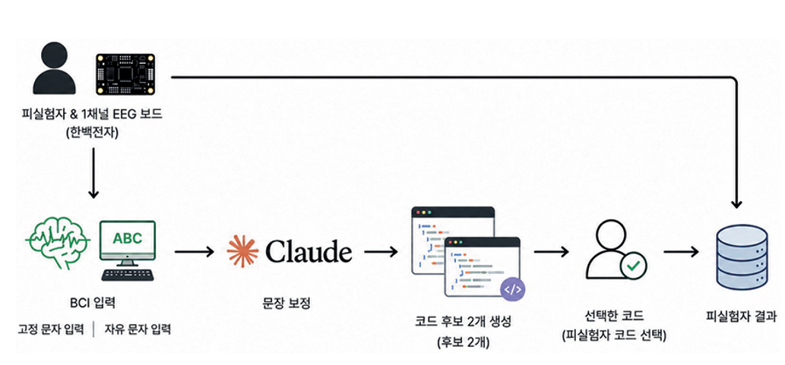

# SSVEP-based Brain-Computer Interface for AI-assisted Programming
 
> An EEG-based brain-computer interface that integrates SSVEP signal classification with LLM-assisted programming.

본 프로젝트는 **EEG 기반 Brain-Computer Interface(BCI)와 LLM을 결합하여 생체신호를 AI 시스템의 입력으로 활용하는 방법**을 탐구한 프로젝트입니다.

SSVEP 기반 EEG 신호를 수집·분류하고, 제한적인 EEG 입력을 자연어 명령으로 변환한 뒤 LLM을 이용한 Python 코드 생성까지 연결하는 **End-to-End AI-assisted programming pipeline**을 구현했습니다.

또한 실제 사용자 실험을 수행하고, EEG 신호의 불확실성을 고려한 **classification threshold optimization**을 통해 입력 안정성을 개선했습니다.

---

## Project Overview

### Motivation

기존 EEG 기반 BCI는 의료 및 재활 분야를 중심으로 활용되어 왔습니다.

본 프로젝트에서는 EEG를 단순한 생체신호 분석 대상으로 사용하는 것을 넘어, **AI 시스템과 상호작용하기 위한 새로운 입력 modality**로 활용하고자 했습니다.

특히 제한적인 EEG 입력을 LLM의 자연어 이해 및 코드 생성 능력과 결합하여, 단순한 명령 입력을 보다 복잡한 programming task로 확장하는 시스템을 구축했습니다.

---

## Objectives

* SSVEP 기반 EEG 입력 시스템 구현
* EEG 신호 수집 및 SSVEP classification
* FBCCA 및 CCA 기반 분류 성능 비교
* EEG 입력을 programming command로 변환
* LLM 기반 사용자 의도 보정 및 Python 코드 생성
* Classification threshold optimization을 통한 입력 안정성 개선
* 실제 사용자 실험을 통한 시스템 검증

---

## System Architecture



```text
SSVEP Stimulus
      ↓
EEG Acquisition
      ↓
Signal Processing
      ↓
FBCCA / CCA Classification
      ↓
Command Generation
      ↓
LLM Prompt Refinement
      ↓
Python Code Generation
      ↓
User Selection
```

---

## Workflow

### 1. SSVEP Stimulus & EEG Acquisition

사용자는 서로 다른 주파수로 깜빡이는 시각 자극 중 원하는 항목을 응시하고, 이에 따라 발생하는 SSVEP 반응을 EEG 신호로 수집합니다.

본 실험에서는 다음 4개의 자극 주파수를 사용했습니다.


```text
9.25 Hz · 10 Hz · 12 Hz · 15 Hz
```

---

### 2. SSVEP Classification

수집된 EEG 신호에서 SSVEP 특성을 분석하고 **FBCCA (Filter Bank Canonical Correlation Analysis)**를 이용하여 사용자가 응시한 자극 주파수를 분류했습니다.

또한 CCA 기반 classification을 함께 수행하여 두 방법의 성능을 비교했습니다.

```text
EEG Signal
    ↓
Signal Processing
    ↓
CCA / FBCCA
    ↓
Stimulus Frequency
```

---

### 3. Command Generation

분류된 SSVEP 결과를 프로그래밍 작업과 관련된 제한적인 command로 변환했습니다.

```text
SSVEP Classification
        ↓
Command Mapping
        ↓
"sort list"
```

---

### 4. LLM-based Prompt Refinement

EEG 입력으로 생성된 짧거나 불완전한 command를 Claude를 이용하여 구체적인 programming instruction으로 확장했습니다.

```text
"sort list"
      ↓
"Write Python code to sort a list in ascending order."
```

이를 통해 제한적인 BCI 입력을 **LLM이 이해할 수 있는 구체적인 programming instruction으로 확장**했습니다.

---

### 5. AI Code Generation

보정된 자연어 명령을 Claude에 전달하여 Python 코드를 생성했습니다.

```text
EEG-derived Command
        ↓
Prompt Refinement
        ↓
Programming Instruction
        ↓
Claude
        ↓
Python Code
```

생성된 코드 후보를 사용자가 확인하고 선택할 수 있도록 구성하여 EEG 입력부터 코드 생성까지의 interaction loop를 구현했습니다.

---

### 6. Result Storage

EEG 신호, classification 결과 및 사용자 선택 결과를 저장하여 시스템 동작과 실험 결과를 분석할 수 있도록 구성했습니다.

---

## Classification Threshold Optimization

실제 EEG 신호에서는 classification score의 불확실성으로 인해 **noise와 실제 SSVEP response를 구분하기 어려운 문제**가 발생했습니다.

4-class Softmax에서 실제 신호의 confidence가 약 0.30 수준으로 나타나 기존 threshold를 그대로 적용할 경우 유효한 입력까지 제외될 수 있었습니다.

반대로 threshold를 낮추면 random noise의 false positive가 증가하는 문제가 발생했습니다.

이를 개선하기 위해 **Softmax confidence와 FBCCA score ratio를 함께 사용하는 이중 조건**을 적용했습니다.

```text
Softmax Confidence ≥ 0.27

AND

Original FBCCA Score Ratio ≥ 2.5
```

단일 confidence threshold가 아닌 두 가지 조건을 함께 적용하여 **유효한 EEG 입력을 확보하면서 noise에 의한 false positive를 줄이는 방식**으로 입력 안정성을 개선했습니다.

---

## Experimental Setup

| Item                 | Description            |
| -------------------- | ---------------------- |
| EEG                  | Non-invasive EEG       |
| BCI Paradigm         | SSVEP                  |
| Stimulus Frequency   | 9.25 / 10 / 12 / 15 Hz |
| Classifier           | FBCCA, CCA             |
| AI Model             | Claude                 |
| Programming Language | Python                 |
| Participants         | 13                     |

---

## Results

* FBCCA와 CCA 기반 classification 성능 비교
* Threshold optimization을 통한 실제 입력 통과율 개선
* 동일 threshold 조건에서 약 **75% 높은 통과율** 확인
* **ITR 약 7.2배 향상**
* 13명의 실제 사용자 대상 실험 수행
* 사용자 피드백을 기반으로 interaction 및 UI 개선 방향 도출


---

## My Contributions

* 프로젝트 기획 및 End-to-End 시스템 아키텍처 설계
* EEG 및 SSVEP 관련 연구 조사
* EEG signal preprocessing 및 SSVEP classification 구현
* FBCCA 및 CCA 기반 classification 성능 비교
* Classification threshold optimization
* Softmax confidence와 FBCCA score ratio를 활용한 이중 조건 설계
* EEG-derived command와 LLM을 연결하는 programming pipeline 구현
* Claude 기반 prompt refinement 및 Python code generation 구현
* 사용자 실험 및 결과 분석

---

## Award & Intellectual Property

* **Excellence Award** — SSVEP-based Brain-Computer Interface Project
* **Patent Application Filed** — EEG-based AI-assisted Programming System

---

## Tech Stack

**Programming**

* Python

**Brain-Computer Interface**

* EEG
* SSVEP
* FBCCA
* CCA
* Signal Processing

**LLM**

* Claude
* Prompt Engineering

**Data Analysis**

* NumPy
* pandas
