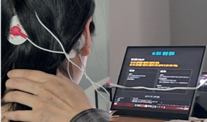
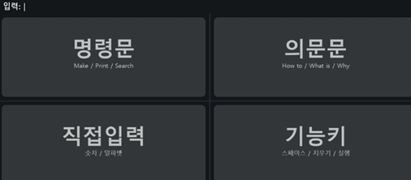
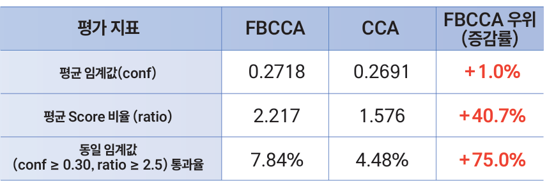

# SSVEP-based Brain-Computer Interface for AI-assisted Programming

> An EEG-based brain-computer interface that integrates SSVEP signal classification with LLM-assisted programming.

본 프로젝트는 **EEG 기반 Brain-Computer Interface(BCI)와 LLM을 결합하여 생체신호를 AI 시스템의 입력으로 활용하는 방법**을 탐구한 프로젝트입니다.

SSVEP 기반 EEG 신호를 수집·분류하고, 제한적인 EEG 입력을 자연어 명령으로 변환한 뒤 LLM을 이용한 Python 코드 생성까지 연결하는 **End-to-End AI-assisted programming pipeline**을 설계 및 구현했습니다.

또한 실제 사용자를 대상으로 실험을 수행하고, EEG 신호의 불확실성을 고려한 classification threshold optimization을 통해 시스템의 입력 안정성을 개선했습니다.

---

## Project Overview

### Motivation

기존의 EEG 기반 BCI는 의료, 재활 등의 분야를 중심으로 활용되어 왔습니다.

본 프로젝트에서는 EEG를 단순한 생체신호 분석 대상으로 사용하는 것을 넘어, **AI 시스템과 상호작용하기 위한 새로운 입력 modality**로 활용하고자 했습니다.

특히 EEG 기반 BCI는 사용자가 전달할 수 있는 명령의 종류와 표현이 제한적이라는 한계가 있습니다. 이를 LLM의 자연어 이해 및 생성 능력과 결합하면, 제한적인 EEG 입력으로부터 사용자의 의도를 확장하여 보다 복잡한 작업으로 연결할 수 있다고 보았습니다.

이를 바탕으로 **SSVEP 기반 EEG 입력 → 명령 생성 → LLM 기반 자연어 보정 → Python 코드 생성**으로 이어지는 AI-assisted programming 환경을 구축했습니다.

---

## Objectives

* SSVEP 기반 EEG 입력 시스템 구현
* EEG 신호의 실시간 수집 및 분류
* FBCCA 및 CCA 기반 분류 성능 비교
* 제한적인 EEG 입력을 자연어 명령으로 변환
* LLM 기반 사용자 의도 보정 및 Python 코드 생성
* EEG 신호의 불확실성을 고려한 입력 threshold optimization
* 실제 사용자 실험을 통한 시스템 검증

---

## System Architecture

```

```

---

## Workflow

### 1. SSVEP Stimulus

사용자는 서로 다른 주파수로 깜빡이는 시각 자극 중 원하는 항목을 응시합니다.

본 실험에서는 다음 4개의 자극 주파수를 사용했습니다.


```text
9.25 Hz · 10 Hz · 12 Hz · 15 Hz
```

사용자가 특정 자극을 응시하면 해당 주파수와 관련된 SSVEP 반응이 EEG 신호에 나타납니다.

---

### 2. EEG Acquisition

비침습형 EEG 장비를 이용하여 사용자의 EEG 신호를 수집했습니다.

수집된 EEG 신호는 이후 전처리 및 SSVEP classification 단계의 입력으로 사용됩니다.

---

### 3. Signal Classification

수집된 EEG 신호에서 SSVEP 특성을 분석하고 **FBCCA (Filter Bank Canonical Correlation Analysis)**를 이용하여 사용자가 응시한 자극 주파수를 분류했습니다.

또한 CCA 기반 classification을 함께 수행하여 두 방법의 성능을 비교했습니다.

```text
EEG Signal
    ↓
Frequency-band Analysis
    ↓
CCA / FBCCA
    ↓
Stimulus Frequency Classification
```

---

### 4. Command Generation

분류된 SSVEP 결과를 사용자의 제한적인 입력 명령으로 변환합니다.

예를 들어 EEG classification 결과에 따라 프로그래밍 작업과 관련된 짧은 명령을 생성합니다.

```text
SSVEP Classification
        ↓
Command Mapping
        ↓
"sort list"
```

---

### 5. LLM-based Prompt Refinement

EEG 입력으로 생성된 짧거나 불완전한 명령을 Claude를 이용하여 보다 구체적인 자연어 프로그래밍 명령으로 보정합니다.

예시:

```text
Input
↓
sort list
```

```text
LLM Refinement
↓
Write Python code to sort a list in ascending order.
```

이 과정을 통해 제한적인 BCI 입력을 **LLM이 이해할 수 있는 구체적인 programming instruction으로 확장**했습니다.

---

### 6. AI Code Generation

보정된 자연어 명령을 Claude에 전달하여 Python 코드 후보를 생성합니다.

```text
EEG-derived Command
        ↓
Prompt Refinement
        ↓
Programming Instruction
        ↓
Claude
        ↓
Python Code
```

---

### 7. User Selection

생성된 코드 후보를 사용자가 확인하고 원하는 결과를 선택할 수 있도록 구성했습니다.

이를 통해 EEG 입력부터 코드 생성까지의 전체 interaction loop를 구현했습니다.

---

### 8. Result Storage

EEG 신호, classification 결과 및 사용자의 선택 결과를 저장하여 시스템 동작과 실험 결과를 분석할 수 있도록 구성했습니다.

---

## Core Technologies

### SSVEP-based Brain-Computer Interface

SSVEP는 사용자가 특정 주파수의 시각 자극을 응시할 때 EEG 신호에 나타나는 주파수 특성을 이용하여 사용자의 선택을 추론하는 BCI paradigm입니다.

본 프로젝트에서는 SSVEP를 **AI 시스템과 상호작용하기 위한 입력 modality**로 활용했습니다.

---

### FBCCA

**Filter Bank Canonical Correlation Analysis (FBCCA)**를 이용하여 여러 주파수 대역에서 EEG 신호와 reference signal 간의 상관관계를 분석하고 자극 주파수를 분류했습니다.

CCA 기반 classification 결과와 비교하여 분류 성능을 확인했습니다.

---

### LLM-assisted Programming

Claude를 이용하여 EEG 기반의 제한적인 입력을 구체적인 자연어 programming instruction으로 확장하고, 이를 Python 코드 생성으로 연결했습니다.

주요 기능:

* EEG-derived command processing
* Natural language prompt refinement
* User intent expansion
* Python code generation
* Generated code selection

---

## Experimental Setup

| Item                 | Description                     |
| -------------------- | ------------------------------- |
| EEG                  | Non-invasive EEG                |
| BCI Paradigm         | SSVEP                           |
| Stimulus Frequency   | 9.25 Hz / 10 Hz / 12 Hz / 15 Hz |
| Classifier           | FBCCA, CCA                      |
| AI Model             | Claude                          |
| Programming Language | Python                          |
| Participants         | 13                              |

---

## Classification Threshold Optimization

실제 EEG 신호를 처리하는 과정에서 **classification score의 불확실성으로 인해 noise와 실제 SSVEP response를 구분하기 어려운 문제**를 확인했습니다.

4-class Softmax를 적용했을 때 실제 신호에서도 약 0.30 수준의 confidence가 나타났으며, 기존 threshold인 0.6을 적용할 경우 실제 입력까지 제외되는 문제가 발생했습니다.

Threshold를 0.27까지 낮추면 실제 신호의 통과율은 증가했지만, random noise에서도 약 0.25 수준의 confidence가 나타나 false positive가 증가했습니다.

이를 개선하기 위해 **Softmax confidence와 원본 FBCCA score ratio를 함께 사용하는 이중 조건**을 적용했습니다.

```text
Softmax Confidence ≥ 0.27

AND

Original FBCCA Score Ratio ≥ 2.5
```

Softmax confidence를 통해 최소한의 classification confidence를 확인하고, FBCCA score ratio를 통해 가장 높은 score가 두 번째 score보다 충분히 높은 경우에만 입력을 허용하도록 구성했습니다.

이를 통해 **단일 confidence threshold의 한계를 보완하고 EEG 입력의 안정성을 높이는 방식**을 적용했습니다.

---

## Results

* FBCCA와 CCA 기반 classification 성능 비교
* Threshold optimization을 통한 실제 입력 통과율 개선
* 동일 threshold 조건에서 약 **75% 높은 통과율** 확인
* **ITR 약 7.2배 향상**
* 13명의 실제 사용자 대상 실험 수행
* 사용자 피드백을 기반으로 interaction 및 UI 개선 방향 도출


---

## Research Pipeline

본 프로젝트의 핵심 연구 흐름은 다음과 같습니다.

```text
Physiological Signal
        ↓
EEG Signal Processing
        ↓
BCI Classification
        ↓
User Intent
        ↓
LLM-based Intent Expansion
        ↓
AI-assisted Task Execution
```

이를 통해 **생체신호를 AI 시스템의 새로운 입력 modality로 활용하고, LLM을 통해 제한적인 입력을 확장하는 interaction pipeline**을 구현했습니다.

---

## My Contributions

* 프로젝트 기획 및 End-to-End 시스템 아키텍처 설계
* SSVEP 및 EEG 관련 연구 조사
* EEG 기반 사용자 인터페이스 설계 및 구현
* EEG signal preprocessing 및 SSVEP classification
* FBCCA 및 CCA 기반 classification 구현 및 성능 비교
* Classification threshold optimization
* Softmax confidence와 FBCCA score ratio를 활용한 이중 조건 설계
* EEG-derived command와 LLM을 연결하는 programming pipeline 구현
* Claude 기반 prompt refinement 및 Python code generation 구현
* 사용자 실험 설계 및 결과 분석
* 사용자 피드백 기반 UI 개선 방향 도출

---

## Award & Intellectual Property

* **Excellence Award** — SSVEP-based Brain-Computer Interface Project
* **Patent Application Filed** — EEG-based AI-assisted Programming System

---

## Tech Stack

**Programming**

* Python

**Brain-Computer Interface**

* EEG
* SSVEP
* FBCCA
* CCA
* Signal Processing

**LLM**

* Claude
* Prompt Engineering

**Data Analysis**

* NumPy
* pandas
