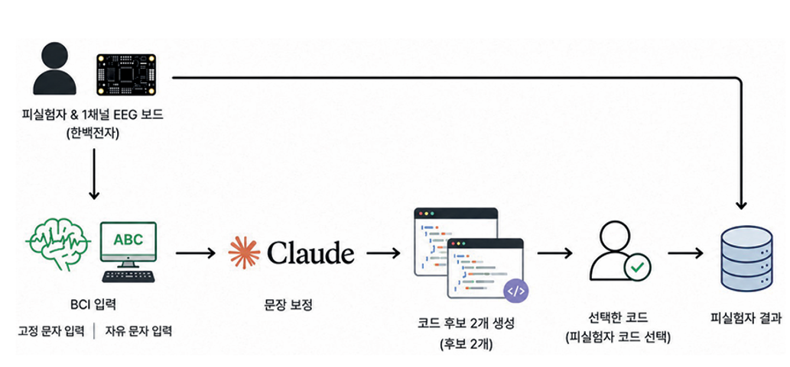
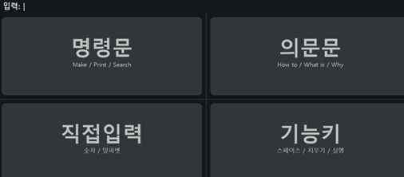
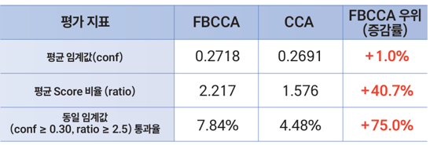

# SSVEP-based Brain-Computer Interface for AI-assisted Programming 

> An EEG-based SSVEP brain-computer interface for signal classification and AI-assisted programming.

본 프로젝트는 **EEG 기반 Brain-Computer Interface(BCI)에서 SSVEP 신호를 분류하고, 이를 AI 시스템의 입력으로 활용하는 방법**을 탐구한 프로젝트입니다.

SSVEP 기반 EEG 신호를 수집하고 **CCA 및 FBCCA 기반 분류 알고리즘을 적용하여 사용자의 입력을 분류**한 뒤, 이를 programming command와 LLM 기반 Python 코드 생성으로 연결하는 **End-to-End AI-assisted programming system**을 구현했습니다.

또한 실제 사용자 실험을 통해 시스템을 검증하고, **분류 결과의 불확실성을 고려한 threshold를 조정하여 EEG 입력의 안정성을 개선**했습니다.

---

## Project Overview

### Motivation

EEG 기반 BCI는 사용자의 의도를 신호로부터 추정하여 외부 시스템을 제어할 수 있는 입력 기술입니다.

본 프로젝트에서는 EEG를 단순한 생체신호 분석 대상으로 사용하는 것을 넘어, **AI 시스템의 입력 modality로 활용하는 방법**을 탐구했습니다.

특히 제한적인 SSVEP 입력을 programming command로 변환하고, 이를 LLM의 자연어 이해 및 코드 생성과 연결하여 **EEG signal classification부터 AI-assisted programming까지 이어지는 시스템**을 구축했습니다.

---

## Objectives

* SSVEP 기반 EEG 입력 시스템 구현
* EEG 신호 수집 및 SSVEP classification
* CCA 및 FBCCA 기반 분류 방법 비교
* EEG 입력을 programming command로 변환
* LLM 기반 programming instruction refinement
* Python code generation pipeline 구현
* Classification threshold 조정을 통한 입력 안정성 개선
* 실제 사용자 실험을 통한 시스템 검증

---

## System Architecture



```text
SSVEP Stimulus
      ↓
EEG Acquisition
      ↓
Signal Processing
      ↓
CCA / FBCCA Classification
      ↓
Command Mapping
      ↓
LLM Prompt Refinement
      ↓
Python Code Generation
      ↓
User Selection
```

---

## Workflow

### 1. SSVEP Stimulus & EEG Acquisition

사용자는 서로 다른 주파수로 깜빡이는 시각 자극 중 원하는 항목을 응시하고, 이에 따라 발생하는 SSVEP 반응을 EEG 신호로 수집합니다.

본 실험에서는 다음 4개의 자극 주파수를 사용했습니다.



```text
9.25 Hz · 10 Hz · 12 Hz · 15 Hz
```

---

### 2. EEG Signal Processing & Classification

수집된 EEG 신호에서 SSVEP 반응을 분석하고, **CCA (Canonical Correlation Analysis)**&#xC640; **FBCCA (Filter Bank Canonical Correlation Analysis)**&#xB97C; 이용하여 사용자가 응시한 자극 주파수를 분류했습니다.

두 분류 방법을 적용하여 성능을 비교하고, 실제 시스템에서 안정적인 입력을 얻기 위한 조건을 탐색했습니다.

```text
EEG Signal
    ↓
Signal Processing
    ↓
CCA / FBCCA
    ↓
Stimulus Frequency
```

---

### 3. Command Mapping

분류된 SSVEP 결과를 프로그래밍 작업과 관련된 command로 변환했습니다.

```text
SSVEP Classification
        ↓
Command Mapping
        ↓
"sort list"
```

---

### 4. LLM-based Prompt Refinement

EEG 입력으로 생성된 제한적인 command를 Claude를 이용하여 보다 구체적인 programming instruction으로 변환했습니다.

```text
"sort list"
      ↓
"Write Python code to sort a list in ascending order."
```

이를 통해 제한적인 BCI 입력을 **LLM이 처리할 수 있는 programming instruction으로 확장**했습니다.

---

### 5. AI-assisted Code Generation

변환된 programming instruction을 Claude에 전달하여 Python 코드를 생성했습니다.

```text
EEG-derived Command
        ↓
Prompt Refinement
        ↓
Programming Instruction
        ↓
Claude
        ↓
Python Code
```

생성된 코드 후보를 사용자가 확인하고 선택할 수 있도록 구성하여 EEG 입력부터 코드 생성까지의 interaction loop를 구현했습니다.

---

### 6. Result Storage

EEG 신호와 classification 결과, 사용자 선택 결과를 저장하여 **시스템 동작 및 실험 결과를 분석**할 수 있도록 구성했습니다.

---

## Classification Threshold Optimization

실제 EEG 신호에서는 classification score의 변동으로 인해 **유효한 SSVEP response와 noise를 구분하기 어려운 문제**가 발생했습니다.

4-class Softmax에서 실제 입력의 confidence가 약 0.30 수준으로 나타나 기존 threshold를 그대로 적용할 경우 유효한 입력까지 제외될 수 있었습니다.

반대로 threshold를 낮추면 random noise에 의한 false positive가 증가할 수 있었습니다.

이를 개선하기 위해 **Softmax confidence와 FBCCA score ratio를 함께 사용하는 이중 조건**을 적용했습니다.

```text
Softmax Confidence ≥ 0.27

AND

Original FBCCA Score Ratio ≥ 2.5
```

단일 confidence threshold 대신 두 가지 조건을 함께 적용하여 **유효한 EEG 입력을 확보하면서 noise에 의한 false positive를 줄이는 방식**으로 입력 안정성을 개선했습니다.

---

## Experimental Setup

| Item                 | Description            |
| -------------------- | ---------------------- |
| EEG                  | Non-invasive EEG       |
| BCI Paradigm         | SSVEP                  |
| Stimulus Frequency   | 9.25 / 10 / 12 / 15 Hz |
| Classifier           | CCA, FBCCA             |
| AI Model             | Claude                 |
| Programming Language | Python                 |
| Participants         | 13                     |

---

## Results

* CCA 및 FBCCA 기반 classification 성능 비교
* Classification threshold 조정을 통한 유효 입력 통과율 개선
* 동일 threshold 조건 대비 약 **75% 높은 통과율** 확인
* **ITR 약 7.2배 향상**
* 13명의 실제 사용자 대상 실험 수행
* 사용자 피드백을 기반으로 interaction 및 UI 개선



---

## My Contributions

* 프로젝트 기획 및 End-to-End 시스템 설계
* EEG 및 SSVEP 관련 연구 조사
* EEG signal preprocessing 및 SSVEP classification 구현
* CCA 및 FBCCA 기반 classification 성능 비교
* Classification threshold 조정 및 조건 설계
* Softmax confidence와 FBCCA score ratio를 활용한 이중 조건 설계
* EEG-derived command와 LLM을 연결하는 programming pipeline 구현
* Claude 기반 prompt refinement 및 Python code generation 구현
* 사용자 실험 설계 및 결과 분석

---

## Award & Intellectual Property

* **Excellence Award** — SSVEP-based Brain-Computer Interface Project
* **Patent Application Filed** — EEG-based AI-assisted Programming System

---

## Tech Stack

**Programming**

* Python

**Signal Processing & BCI**

* EEG
* SSVEP
* CCA
* FBCCA
* Signal Processing

**AI & LLM**

* Claude
* Prompt Engineering

**Data Analysis**

* NumPy
* pandas
